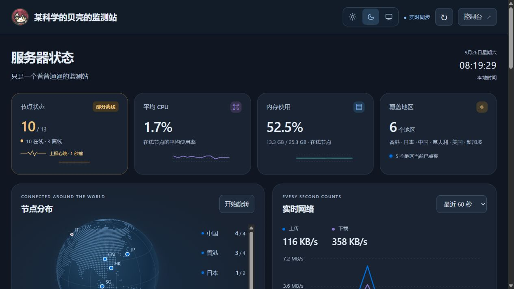
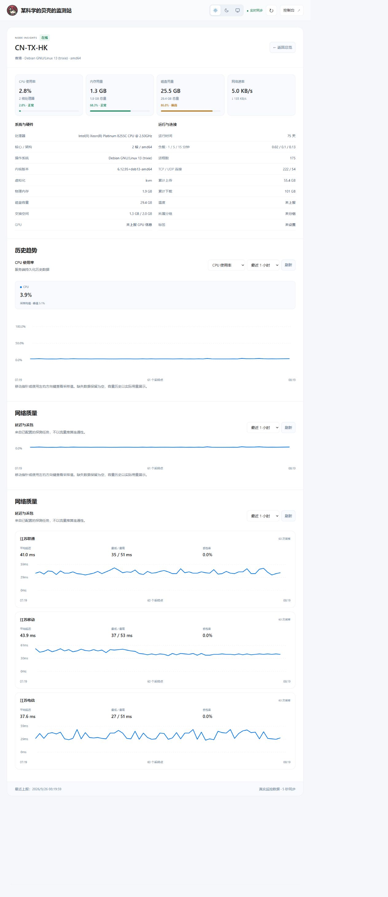

# Aero · 晴空

一款清爽、易读的 **Komari 监控主题**。用舒适的留白、清晰的资源状态和实时曲线，查看每台服务器的运行情况。

[在线演示](https://shell.status.moe/) · [下载安装包](https://github.com/biliblihuorong/komari-theme-aero/releases/latest) · [反馈问题](https://github.com/biliblihuorong/komari-theme-aero/issues)


## 功能

- **清晰的状态概览**：在线数量、平均 CPU、内存使用和地区覆盖；部分离线显示橙色，全部离线显示红色，上报更新时显示心跳反馈。
- **交互地球**：在线地区点亮，支持旋转、拖动、键盘控制和点击地区定位。
- **实时网络趋势**：查看最近 60 秒或 5 分钟的上传、下载速率。悬停预览采样时刻的节点排行，点击固定浮窗后可展开全部节点。
- **完整节点详情**：整张卡片可点击，进入独立详情页；硬件、运行概况、历史趋势和网络质量在同一页展示。
- **多指标历史**：CPU、内存、磁盘、Swap、网络速率、负载、进程和连接数，支持 1 / 6 / 24 小时及 7 天。
- **网络质量**：展示已配置探测任务的延迟曲线与采样丢包比例。
- **资源占用分级**：CPU、内存和磁盘低于 70% 为绿色，70% 至不足 90% 为橙色，90% 及以上为红色，同时保留百分比。
- **明暗外观**：太阳、月亮、系统三个图标切换，默认跟随系统并记住手动选择。自动模式根据系统／浏览器的深浅色偏好切换，不按固定时钟判断白天或夜晚；系统外观改变时无需刷新。
- **手机与平板适配**：响应式卡片、图表和详情布局；支持触屏与键盘，遵循系统“减少动态效果”偏好。
- **沿用站点品牌**：自动读取站点名称、说明和头像，支持搜索、分组、状态筛选与排序。

## 截图

截图来自 [shell.status.moe](https://shell.status.moe/)，为真实公开监控数据，数值会随时间变化。

### 深色外观



### 服务器详情



## 安装

已在 **Komari 1.5.1** 上验证。其他版本暂未完成兼容性验证。

1. 在 [最新 Release](https://github.com/biliblihuorong/komari-theme-aero/releases/latest) 下载 **`aero.zip`**。
2. 打开 Komari 管理后台 → 主题管理，上传该 ZIP。
3. 选择 **Aero · 晴空** 并启用。
4. 按需在主题设置中修改页面标题和说明。

请下载 Release 附件 `aero.zip`，不要使用 GitHub 自动生成的 `Source code (zip)`。安装包根目录包含 `komari-theme.json`、`dist/` 和预览图。无需修改探针或数据库，原主题可以保留并随时切回。

| 设置 | 说明 |
| --- | --- |
| 页面标题 | 默认“服务器状态” |
| 页面说明 | 留空时沿用站点说明 |
| 外观 | 由每位访客在顶部切换，保存到其浏览器 |

## 数据说明

- 实时状态每 5 秒刷新；隐藏标签页暂停轮询。同步失败或数据过期会明确提示。
- 实时曲线使用真实采样；短时历史仅合并当前在线节点都有新鲜记录的时间段，不补造数据。在线数量趋势仅反映本次浏览观测。
- 缺失数据保留为空，失败的延迟采样不画成 0 ms。历史范围和精度取决于服务端的数据保留设置。
- 累计上传、下载来自探针计数，不等同于月度账单。
- 地球位置是国家／地区示意，不代表机房精确位置。
- 主题提供监控前台；用户、探针、通知等管理继续使用 Komari 原生后台。私有站点需先在原生后台登录。

## 本地预览

需要 Node.js 22 或更新版本，无需安装 npm 依赖：

```sh
npm test
npm run preview
```

打开 `http://127.0.0.1:4173/`。预览工具仅代理演示站的公开只读接口，不代理后台或登录凭据；安装到 Komari 后，主题使用所在站点的同域接口，不绑定演示站。

## 打包与发布

需要 Python 3.10 或更新版本：

```sh
python scripts/package.py
```

生成 `release/aero.zip` 与对应 SHA-256 校验文件。版本号以 `komari-theme.json` 为准，并须与 `package.json` 一致。

推送与版本匹配的标签（例如 `v1.4.1`）后，GitHub Actions 自动测试、打包并发布 Release。安装包名称固定为 `aero.zip`，便于主题市场跟踪更新。

## 项目结构

```text
dist/                  主题页面、样式、脚本和地图数据（可直接编辑）
komari-theme.json      Komari 主题信息与设置
preview.png            主题市场预览图
docs/images/           README 截图
preview.mjs            本地只读预览服务
test.mjs               数据和交互逻辑检查
scripts/package.py     标准库打包工具
```

原生 HTML、CSS、JavaScript、SVG 与 Canvas 实现，无运行时第三方框架或外部地图 API。

## 致谢与许可

- [Komari](https://github.com/komari-monitor/komari) 与 [主题开发文档](https://komari-document.pages.dev/dev/theme)。
- 地图数据来自 [Natural Earth](https://www.naturalearthdata.com/about/terms-of-use/) 公有领域数据，转换为本地陆地点阵与地区标记。
- 主题代码采用 [MIT License](LICENSE)。截图中的站点内容和头像归各自权利人所有，不随代码许可证授权。

---

**English:** Aero is a clean, responsive Komari theme with light/dark/system appearance, an interactive globe, live traffic charts and per-node rankings, resource severity colors, and a complete instance page with history and network quality. Tested with Komari 1.5.1. Download **`aero.zip`** from the latest release and upload it in Komari's theme manager.
